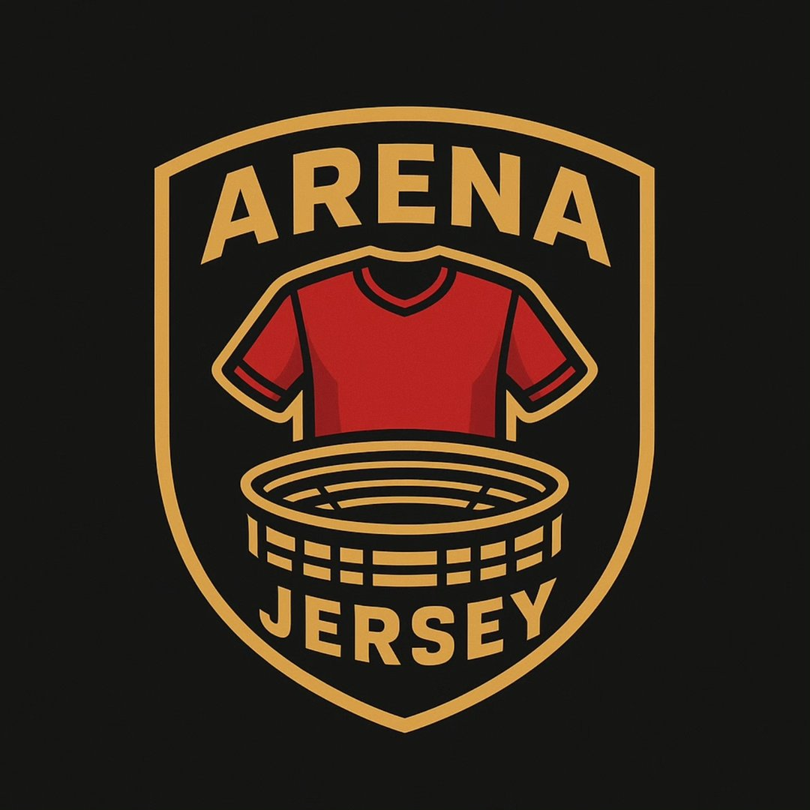
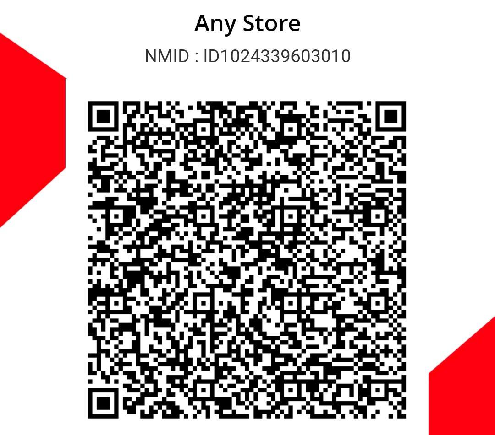

# Kodingan Web Jualan (Arena Jersey)

Berikut adalah keseluruhan kode untuk web jualan. Kamu bisa menyalin (copy) kode di bawah ini jika kamu membutuhkannya.

## 1. `index.html` (Struktur Web)
```html
<!DOCTYPE html>
<html lang="id">

<head>
    <meta charset="UTF-8">
    <meta name="viewport" content="width=device-width, initial-scale=1.0">
    <title>Arena Jersey</title>
    <link rel="stylesheet" href="style.css">
    <link rel="stylesheet" href="https://cdnjs.cloudflare.com/ajax/libs/font-awesome/6.4.0/css/all.min.css">
    <!-- Menggunakan font modern sesuai gambar (Space Grotesk & Inter) -->
    <link
        href="https://fonts.googleapis.com/css2?family=Space+Grotesk:wght@400;600;700&family=Inter:wght@300;400;600&display=swap"
        rel="stylesheet">
</head>

<body>
    <!-- Navbar -->
    <nav class="navbar">
        <div class="nav-brand">
            
            Arena Jersey
        </div>
        <div class="nav-cart" id="cart-icon">
            <i class="fa-solid fa-bag-shopping"></i>
            <span class="cart-badge" id="cart-count">0</span>
        </div>
    </nav>

    <!-- Hero Section (Tampilan Baru) -->
    <section class="hero-section">
        <div class="hero-overlay"></div>
        <div class="hero-content">
            <h1 class="hero-title">Buy the <span class="highlight-text">ORIGINAL</span> soccer jersey<br>from your
                favorite club</h1>

            <div class="hero-center-action">
                <button class="buy-now-btn">Buy Now <i class="fa-solid fa-bag-shopping"></i></button>
            </div>

            <div class="players-container">
                
                
                
                
                
            </div>
        </div>

        <!-- Slanted Banners (Pita Miring Hijau & Kuning) -->
        <div class="banner-wrapper">
            <div class="slanted-banner yellow-banner"></div>
            <div class="slanted-banner green-banner">
                <div class="marquee">
                    <span>JerseyBola &nbsp;&nbsp;&nbsp;&nbsp; End of year 30% discount &nbsp;&nbsp;&nbsp;&nbsp;
                        JerseyBola &nbsp;&nbsp;&nbsp;&nbsp; End of year 30% discount &nbsp;&nbsp;&nbsp;&nbsp; JerseyBola
                        &nbsp;&nbsp;&nbsp;&nbsp; End of year 30% discount &nbsp;&nbsp;&nbsp;&nbsp; JerseyBola
                        &nbsp;&nbsp;&nbsp;&nbsp; End of year 30% discount</span>
                </div>
            </div>
        </div>
    </section>

    <!-- Main Content (Grid Produk di bawah hero) -->
    <main class="main-content">
        <div class="section-header">
            <h2>OUR COLLECTIONS</h2>
        </div>
        <div class="product-grid" id="product-list">
            <!-- Products generated by JS -->
        </div>
    </main>

    <!-- Modal Keranjang -->
    <div id="cart-modal" class="modal">
        <div class="modal-content">
            <span class="close-btn">&times;</span>
            <h2>Your Cart <i class="fa-solid fa-bag-shopping" style="color: var(--green-accent);"></i></h2>
            <div id="cart-items"></div>
            <div class="cart-total">
                <h3>Total: <span id="total-price">Rp0</span></h3>
                <button class="checkout-btn">Checkout</button>
            </div>
        </div>
    </div>

    <!-- Checkout Page Modal -->
    <div id="checkout-page-modal" class="modal checkout-modal-wrapper">
        <div class="checkout-container">
            <span class="close-checkout-btn">&times;</span>
            <div class="checkout-grid">
                <!-- Billing Details -->
                <div class="billing-details">
                    <h3>Billing Details</h3>
                    <div class="form-row">
                        <div class="form-group">
                            <label>First Name <span>*</span></label>
                            <input type="text" id="checkout-firstname" placeholder="First Name">
                        </div>
                        <div class="form-group">
                            <label>Last Name <span>*</span></label>
                            <input type="text" id="checkout-lastname" placeholder="Last Name">
                        </div>
                    </div>
                    <div class="form-group">
                        <label>Company Name (optional)</label>
                        <input type="text" id="checkout-company" placeholder="Company Name">
                    </div>
                    <div class="form-group">
                        <label>Country / Region <span>*</span></label>
                        <select id="checkout-country">
                            <option>Indonesia</option>
                        </select>
                    </div>
                    <div class="form-group">
                        <label>Street address <span>*</span></label>
                        <input type="text" id="checkout-address1" placeholder="House number and street name" style="margin-bottom: 15px;">
                        <input type="text" id="checkout-address2" placeholder="Apartment, suite, unit, etc. (optional)">
                    </div>
                    <div class="form-group">
                        <label>Town / City <span>*</span></label>
                        <input type="text" id="checkout-city">
                    </div>
                    <div class="form-group">
                        <label>Province <span>*</span></label>
                        <select id="checkout-province">
                            <option>Jawa Tengah</option>
                            <option>Jawa Barat</option>
                            <option>Jawa Timur</option>
                            <option>DKI Jakarta</option>
                            <option>DI Yogyakarta</option>
                            <option>Banten</option>
                            <option>Bali</option>
                        </select>
                    </div>
                    <div class="form-group">
                        <label>Postcode / ZIP <span>*</span></label>
                        <input type="text" id="checkout-zip">
                    </div>
                    <div class="form-group">
                        <label>Phone <span>*</span></label>
                        <input type="tel" id="checkout-phone" placeholder="Phone">
                    </div>
                    <div class="form-group">
                        <label>Email Address <span>*</span></label>
                        <input type="email" id="checkout-email" placeholder="Email Address">
                    </div>
                    <div class="form-group" style="margin-top: 30px;">
                        <label>Order notes (optional)</label>
                        <textarea id="checkout-notes" placeholder="Notes about your order, e.g. special notes for delivery." rows="5"></textarea>
                    </div>
                </div>

                <!-- Your Order -->
                <div class="order-summary-section">
                    <div class="order-box">
                        <h3>Your Order</h3>
                        <div class="order-table">
                            <div class="order-table-header">
                                <span>Product</span>
                                <span>Subtotal</span>
                            </div>
                            <div id="checkout-order-items">
                                <!-- Items injected by JS -->
                            </div>
                            <div class="order-table-row subtotal-row">
                                <span>Subtotal</span>
                                <span id="checkout-subtotal">Rp0</span>
                            </div>
                            <div class="order-table-row total-row">
                                <span>Total</span>
                                <span id="checkout-total">Rp0</span>
                            </div>
                        </div>
                    </div>
                    
                    <div class="coupon-box">
                        Have a coupon? <a href="#">Click here to enter your coupon code</a>
                    </div>

                    <div class="payment-box">
                        <div class="payment-method active">
                            <input type="radio" name="payment" id="pay-qris" checked>
                            <label for="pay-qris">QRIS (Gopay, OVO, Dana, dll)</label>
                            <div class="payment-desc">
                                Silakan scan QR Code di bawah ini untuk melakukan pembayaran:<br>
                                
                            </div>
                        </div>
                        <div class="payment-method">
                            <input type="radio" name="payment" id="pay-mandiri">
                            <label for="pay-mandiri">Transfer Bank (Mandiri)</label>
                            <div class="payment-desc">
                                Lakukan transfer ke rekening Mandiri berikut:<br>
                                <strong>No. Rekening: 1090022196083</strong><br>
                                (Simpan bukti transfer Anda untuk proses konfirmasi pesanan)
                            </div>
                        </div>
                        <p class="privacy-text">
                            Your personal data will be used to process your order, support your experience throughout this website, and for other purposes described in our <a href="#">privacy policy</a>.
                        </p>
                        <button class="place-order-btn" id="place-order-btn">Place Order</button>
                    </div>
                </div>
            </div>
        </div>
    </div>

    <!-- Success Modal -->
    <div id="success-modal" class="modal" style="z-index: 1100;">
        <div class="modal-content" style="text-align: center; max-width: 450px; padding: 50px 30px;">
            <div style="font-size: 60px; color: var(--green-accent); margin-bottom: 20px;">
                <i class="fa-solid fa-circle-check"></i>
            </div>
            <h2 style="margin-bottom: 15px;">Checkout Berhasil!</h2>
            <p style="color: #666; margin-bottom: 30px; line-height: 1.5;">
                Terima kasih telah berbelanja di Arena Jersey. Pesanan Anda telah kami terima dan sedang diproses.
            </p>
            <button class="checkout-btn" id="close-success-btn" style="width: 100%;">Kembali ke Beranda</button>
        </div>
    </div>

    <script src="script.js"></script>
</body>

</html>
```

## 2. `script.js` (Logika Pembelian)
```javascript
const products = [
    {
        id: 1,
        title: "Jersey Arsenal 2000-2001 Away",
        price: 1600000,
        image: "arsenal_dreamcast.jpg"
    },
    {
        id: 2,
        title: "Jersey Bola - Away Edition",
        price: 245000,
        image: "https://images.unsplash.com/photo-1560272564-c83b66b1ad12?auto=format&fit=crop&q=80&w=400"
    },
    {
        id: 3,
        title: "Celana Training Premium",
        price: 150000,
        image: "https://images.unsplash.com/photo-1552902865-b72c031ac5ea?auto=format&fit=crop&q=80&w=400"
    },
    {
        id: 4,
        title: "Jaket Olahraga Timnas",
        price: 350000,
        image: "https://images.unsplash.com/photo-1556822284-ce444005b5db?auto=format&fit=crop&q=80&w=400"
    }
];

let cart = [];

// Format Currency
const formatRupiah = (number) => {
    return new Intl.NumberFormat('id-ID', {
        style: 'currency',
        currency: 'IDR',
        minimumFractionDigits: 0
    }).format(number);
};

// Render Products
const renderProducts = () => {
    const productList = document.getElementById('product-list');
    productList.innerHTML = '';

    products.forEach(product => {
        const productEl = document.createElement('div');
        productEl.classList.add('product-card');

        productEl.innerHTML = `
            
            <div class="product-info">
                <div class="product-title">${product.title}</div>
                <div class="product-price-row">
                    <div class="product-price">${formatRupiah(product.price)}</div>
                    <button class="btn-yellow-cart" onclick="addToCart(${product.id})" title="Tambah ke Keranjang">
                        <i class="fa-solid fa-cart-plus"></i>
                    </button>
                </div>
            </div>
        `;

        productList.appendChild(productEl);
    });
};

// Add to Cart
const addToCart = (productId) => {
    const product = products.find(p => p.id === productId);
    cart.push(product);
    updateCartBadge();

    alert(`🛒 "${product.title}" berhasil ditambahkan ke keranjang kuning!`);
};

// Remove from Cart
const removeFromCart = (index) => {
    cart.splice(index, 1);
    updateCartBadge();
    renderCartItems();
};

// Update Cart Badge
const updateCartBadge = () => {
    const cartCount = document.getElementById('cart-count');
    cartCount.innerText = cart.length;
};

// Modal Logic
const modal = document.getElementById('cart-modal');
const cartIcon = document.getElementById('cart-icon');
const closeBtn = document.querySelector('.close-btn');
const checkoutBtn = document.querySelector('.checkout-btn');

const checkoutModal = document.getElementById('checkout-page-modal');
const closeCheckoutBtn = document.querySelector('.close-checkout-btn');
const placeOrderBtn = document.getElementById('place-order-btn');

const renderCartItems = () => {
    const cartItemsContainer = document.getElementById('cart-items');
    const totalPriceEl = document.getElementById('total-price');

    cartItemsContainer.innerHTML = '';

    if (cart.length === 0) {
        cartItemsContainer.innerHTML = '<p style="text-align:center; padding: 30px 0; color: #999;">Keranjang belanja kamu masih kosong.</p>';
        totalPriceEl.innerText = formatRupiah(0);
        return;
    }

    let total = 0;

    cart.forEach((item, index) => {
        total += item.price;

        const itemEl = document.createElement('div');
        itemEl.classList.add('cart-item');
        itemEl.innerHTML = `
            <div class="cart-item-info">
                
                <span class="cart-item-title">${item.title}</span>
            </div>
            <div style="display:flex; align-items:center; gap: 20px;">
                <span class="cart-item-price">${formatRupiah(item.price)}</span>
                <button class="remove-btn" onclick="removeFromCart(${index})"><i class="fa-solid fa-trash"></i></button>
            </div>
        `;
        cartItemsContainer.appendChild(itemEl);
    });

    totalPriceEl.innerText = formatRupiah(total);
};

const renderCheckoutItems = () => {
    const checkoutOrderItemsContainer = document.getElementById('checkout-order-items');
    const checkoutSubtotalEl = document.getElementById('checkout-subtotal');
    const checkoutTotalEl = document.getElementById('checkout-total');

    checkoutOrderItemsContainer.innerHTML = '';
    let total = 0;

    cart.forEach(item => {
        total += item.price;
        const row = document.createElement('div');
        row.classList.add('checkout-item-row');
        row.innerHTML = `
            <div class="checkout-item-name">${item.title} <strong style="color:#333;">× 1</strong></div>
            <div class="checkout-item-price">${formatRupiah(item.price)}</div>
        `;
        checkoutOrderItemsContainer.appendChild(row);
    });

    checkoutSubtotalEl.innerText = formatRupiah(total);
    checkoutTotalEl.innerText = formatRupiah(total);
};

cartIcon.addEventListener('click', () => {
    renderCartItems();
    modal.style.display = 'block';
});

closeBtn.addEventListener('click', () => {
    modal.style.display = 'none';
});

closeCheckoutBtn.addEventListener('click', () => {
    checkoutModal.style.display = 'none';
});

// Success Modal Logic
const successModal = document.getElementById('success-modal');
const closeSuccessBtn = document.getElementById('close-success-btn');

closeSuccessBtn.addEventListener('click', () => {
    successModal.style.display = 'none';
});

window.addEventListener('click', (event) => {
    if (event.target === modal) {
        modal.style.display = 'none';
    }
    if (event.target === checkoutModal) {
        checkoutModal.style.display = 'none';
    }
    if (event.target === successModal) {
        successModal.style.display = 'none';
    }
});

checkoutBtn.addEventListener('click', () => {
    if (cart.length > 0) {
        modal.style.display = 'none';
        renderCheckoutItems();
        checkoutModal.style.display = 'block';
    } else {
        alert('Keranjang belanja masih kosong!');
    }
});

placeOrderBtn.addEventListener('click', () => {
    // 1. Ambil data dari form
    const firstName = document.getElementById('checkout-firstname').value.trim();
    const lastName = document.getElementById('checkout-lastname').value.trim();
    const address = document.getElementById('checkout-address1').value.trim();
    const city = document.getElementById('checkout-city').value.trim();
    const phone = document.getElementById('checkout-phone').value.trim();
    const email = document.getElementById('checkout-email') ? document.getElementById('checkout-email').value.trim() : "";
    const notes = document.getElementById('checkout-notes') ? document.getElementById('checkout-notes').value.trim() : "";

    // 2. Validasi sederhana
    if (!firstName || !address || !city || !phone) {
        alert('Mohon lengkapi data yang bertanda bintang (*)!');
        return;
    }

    const originalBtnText = placeOrderBtn.innerText;
    placeOrderBtn.innerText = 'Memproses...';
    placeOrderBtn.disabled = true;

    // 3. Siapkan daftar pesanan
    let orderDetails = '';
    let total = 0;
    cart.forEach((item, index) => {
        orderDetails += `${index + 1}. ${item.title} (Rp ${item.price.toLocaleString('id-ID')})\n`;
        total += item.price;
    });

    const selectedPayment = document.querySelector('input[name="payment"]:checked').nextElementSibling.innerText;

    const emailData = {
        _subject: `Pesanan Baru dari ${firstName} ${lastName}`,
        _captcha: "false",
        Nama: `${firstName} ${lastName}`,
        Email: email,
        Telepon: phone,
        Alamat: `${address}, ${city}`,
        Catatan: notes,
        Pesanan: orderDetails,
        Total: `Rp ${total.toLocaleString('id-ID')}`,
        Metode_Pembayaran: selectedPayment
    };

    // 6. ALAMAT EMAIL ANDA
    const targetEmail = "nabilanam090807@gmail.com"; 

    // 7. Kirim pesanan menggunakan Form
    const form = document.createElement('form');
    form.action = `https://formsubmit.co/${targetEmail}`;
    form.method = "POST";
    form.target = "_blank"; 

    for (const key in emailData) {
        const input = document.createElement('input');
        input.type = 'hidden';
        input.name = key;
        input.value = emailData[key];
        form.appendChild(input);
    }

    document.body.appendChild(form);
    form.submit();
    document.body.removeChild(form);

    placeOrderBtn.innerText = originalBtnText;
    placeOrderBtn.disabled = false;

    // 8. Tampilkan notifikasi sukses
    cart = [];
    updateCartBadge();
    checkoutModal.style.display = 'none';
    successModal.style.display = 'block';
});

// Payment Method Toggle
const paymentRadios = document.querySelectorAll('input[name="payment"]');
paymentRadios.forEach(radio => {
    radio.addEventListener('change', (e) => {
        document.querySelectorAll('.payment-method').forEach(method => method.classList.remove('active'));
        if (e.target.checked) {
            e.target.closest('.payment-method').classList.add('active');
        }
    });
});

// Init
document.addEventListener('DOMContentLoaded', () => {
    renderProducts();
});
```

*(Catatan: File `style.css` tidak disertakan penuh di sini karena terlalu panjang, namun kamu bisa menggunakan file `style.css` yang sudah ada di foldermu)*
